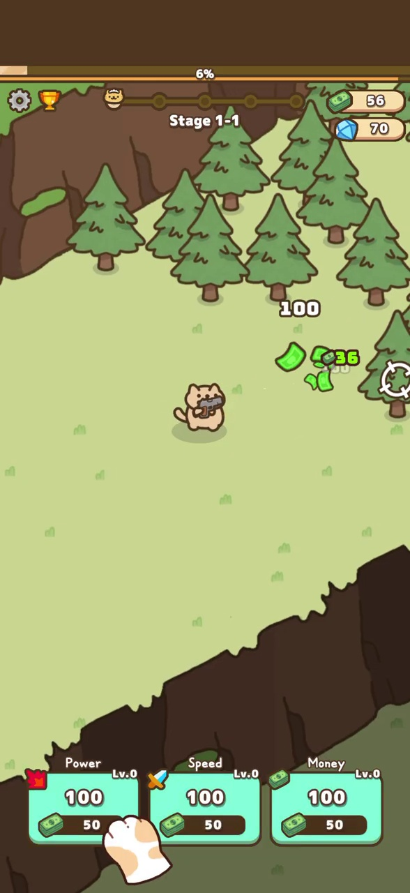
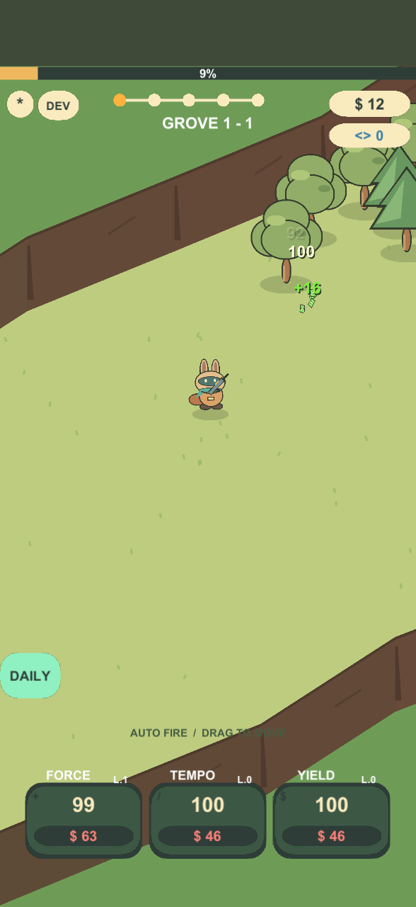
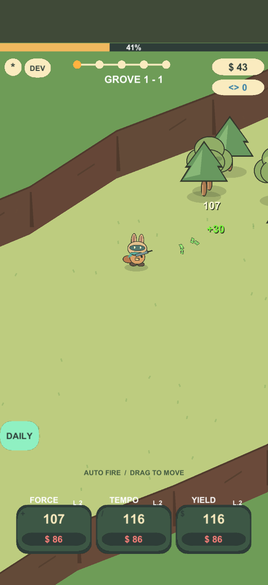
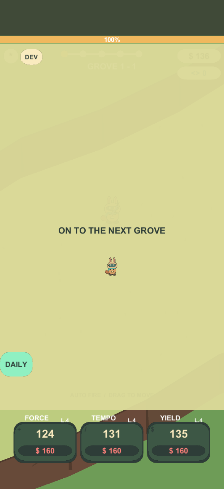

# Visual comparison — mechanical prototype

These are composition comparisons, not frame-synchronized playback. Reference time is the video's clock; prototype time starts when its simulation begins. The original recording includes menus and purchases that the fresh prototype run does not reproduce.

| Early reference (00:09) | Prototype (~8 seconds) |
|---|---|
|  |  |

| Mid-opening prototype (~25 seconds) | Stage transfer |
|---|---|
|  |  |

## Findings and changes
- Portrait framing, upper-right currencies, five-node stage track, three lower upgrade cards and diagonal ground composition follow the measured structure.
- Leader is held around the horizontal center and slightly above vertical center; no zoom/rotation. The original character shape differs, so visible silhouette bounds are not identical.
- Initial captures were too sparse and the ranger too small. Target clustering was tightened, the ranger enlarged, and target HP adjusted to retain the early clearing cadence.
- The stage track now highlights the current sector. Upgrade affordability is visible through bright/dim fills and price colors.
- A capture-specific sorting issue let world sprites overlap modal panels; explicit high canvas sorting fixed it. The developer clear action now uses remaining HP and cannot overflow integer damage labels.
- The visuals remain simple original artwork. A later presentation pass adds readable number shadows, pointed palm fronds, uneven cliff rims, equipment tint and weapon recoil; the reference still has fuller vegetation and more elaborate animation/effects.
- Subsequent updates implement timed challenges, equipment/collection, a player-facing second shooter, daily rewards and missions. Later-game equivalence is still not claimed.

## Timing evidence
The final in-engine deterministic model produces first/second stage cycles of 50.55s and 70.38s, including clear/transfer. The reference estimates are approximately 49s and 75s active play, with short transitions. These are close starting values, not exact replicas; purchase/input schedules and frame cadence differ. The real player's normal-speed telemetry is in `runtime-telemetry.csv`.

Runtime screenshots come from the game's camera plus UGUI rendered to a 588 × 1280 texture, so they show the actual assets and layout. Audio was not auditioned against the original. No claim of matched sound or certified Android performance is made.

## Presentation pass — 2026-09-30
See [PRESENTATION_UPDATE.md](PRESENTATION_UPDATE.md). The normal-speed capture harness now renders an initial warm-up frame before recording comparison images: the first offscreen canvas-mode switch omitted static buttons even when graphics were marked dirty. The warm-up is not used as comparison evidence; the inspected eight-second frame now includes Settings, DEV and DAILY. This addresses the diagnostic capture path, not a claimed input failure in normal play.
